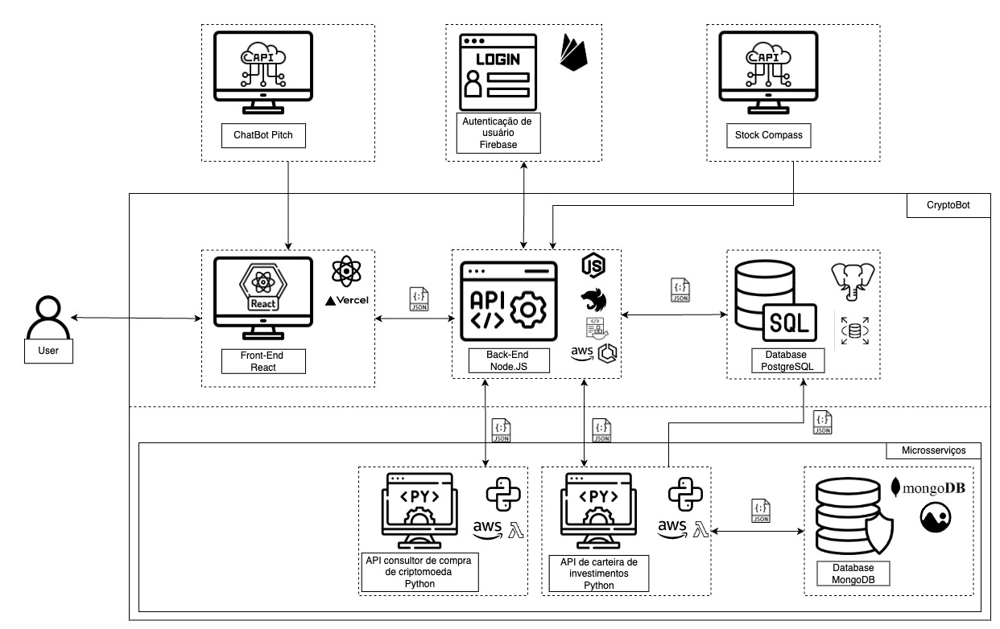

# Documento de Arquitetura

## Introdução

Este documento tem como objetivo apresentar a arquitetura do projeto CryptoBot, um sistema de negociação de criptomoedas automatizado. A arquitetura de software é uma descrição dos principais componentes do sistema, suas interações e como eles se relacionam para atender aos requisitos do sistema. A arquitetura é uma parte fundamental do desenvolvimento de software, pois fornece uma visão geral do sistema e ajuda a orientar o desenvolvimento de software de forma eficiente e eficaz.

### Importância do Documento de Arquitetura

:pushpin: O Documento de Arquitetura é uma parte fundamental do desenvolvimento de software, pois fornece uma visão geral do sistema e ajuda a orientar o desenvolvimento de software de forma eficiente e eficaz.

## Visão Geral da Arquitetura

A arquitetura do sistema CryptoBot é composta por vários componentes que se comunicam entre si para fornecer uma experiência de negociação de criptomoedas eficiente e eficaz para os usuários. A seguir, são apresentados os principais componentes da arquitetura do sistema CryptoBot:

<!-- - **Interface do Usuário (UI)**: A interface do usuário é a camada de interação entre o usuário e o sistema. Ela permite que o usuário interaja com o sistema de forma intuitiva e eficiente. -->

- **Frontend**: O frontend é a camada de apresentação do sistema. Ele é responsável por exibir informações ao usuário e coletar dados por meio da interface do usuário. A tecnologia utilizada para o frontend é o React, uma biblioteca JavaScript para a criação de interfaces de usuário. O deploy do frontend é feito no Vercel, uma plataforma de hospedagem de aplicativos.

- **Backend**: O backend é a camada de processamento do sistema. Ele é responsável por processar as solicitações do usuário, acessar os dados do sistema e fornecer as respostas apropriadas. O backend é desenvolvido em Node.js e utilizando o framework Nest.js. O backend é containerizado com Docker hospedado no AWS Elastic Container Service (ECS).

- **APIs**: As APIs são interfaces de programação de aplicativos que permitem que diferentes sistemas se comuniquem entre si. Elas são usadas para integrar diferentes componentes do sistema e permitir a comunicação entre eles. As APIs do CryptoBot utilizam a arquitetura de microsserviços para garantir a escalabilidade e a flexibilidade do sistema. Elas são desenvolvidas em Python e hospedadas no AWS Lambda e são responsáveis por fornecer informações de mercado e executar as estratégias de negociação.

- **Banco de Dados**: O banco de dados é responsável por armazenar os dados do sistema. Ele fornece uma maneira eficiente de armazenar e recuperar dados, garantindo que o sistema tenha acesso às informações necessárias. O backend do CryptoBot utiliza o banco de dados PostgreSQL para armazenar os dados do sistema. Já o banco de dados da carteira de investimentos é o MongoDB, que armazena informações sobre as transações, saldos e histórico de negociações dos usuários.

- **Serviços de Terceiros**: O sistema CryptoBot pode integrar-se a serviços de terceiros, como plataformas de negociação de criptomoedas e provedores de dados de mercado. Esses serviços são essenciais para o funcionamento do sistema e fornecem informações valiosas para os usuários. Um deles é a integração com a Binance, uma das maiores corretoras de criptomoedas do mundo, que fornece informações de mercado e permite a execução de ordens de negociação. Outro serviço é o Firebase, que é utilizado para autenticação de usuários e armazenamento de dados em tempo real.

## Diagrama de Arquitetura

O diagrama de arquitetura a seguir ilustra a estrutura geral do sistema CryptoBot e como seus componentes se relacionam entre si. O diagrama mostra a interação entre a interface do usuário, o backend, as APIs, o banco de dados e os serviços de terceiros.

O documento de arquitetura do CryptoBot pode ser acessado [clicando aqui](https://drive.google.com/file/d/1q_XES_tDbplfQkOVMqkKJ_Pc38-H0qWF/view?usp=sharing) ou visualizado abaixo:

## Considerações Finais

A arquitetura do sistema CryptoBot é fundamental para o desenvolvimento de software eficiente e eficaz. Ela fornece uma visão geral do sistema e ajuda a orientar o desenvolvimento de software de forma estruturada e organizada. O documento de arquitetura apresentado neste documento descreve os principais componentes do sistema e como eles se relacionam entre si para atender aos requisitos do sistema.

A arquitetura do sistema CryptoBot é flexível e escalável, permitindo que o sistema seja facilmente adaptado e expandido para atender às necessidades dos usuários. Com uma arquitetura bem definida, o sistema CryptoBot será capaz de fornecer uma experiência de negociação de criptomoedas eficiente e eficaz para os usuários.

O desenvolvimento do sistema CryptoBot continuará a ser guiado pela arquitetura apresentada neste documento, garantindo que o sistema seja desenvolvido de acordo com as melhores práticas de engenharia de software e atenda aos requisitos dos usuários.

## Histórico de versão

| Data | Versão | Modificação | Autor |
| :- | :- | :- | :- |
| 23/04/2024 | 0.1 | Criação do documento | [Ailton Aires](https://github.com/ailtonaires) |
