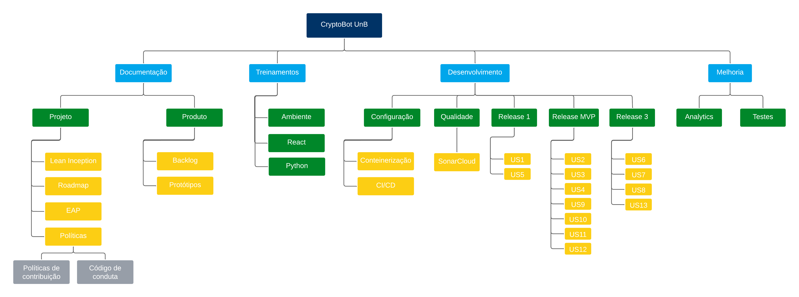

# EAP (Estrutura Analítica do Projeto)

## Histórico de versão

| Data | Versão | Modificação | Autor |
| :- | :- | :- | :- |
| 16/04/2024 | 0.1 | Criação do documento | [João Durso](https://github.com/jvsdurso) | 

## Introdução

Segundo o PMBOK, Estrutura Analítica do Projeto (EAP) é uma ferramenta fundamental na gestão de projetos. Ela representa visualmente o escopo do projeto, dividindo-o em componentes menores e mais gerenciáveis chamados de pacotes de trabalho. Cada pacote de trabalho na EAP é uma entrega específica do projeto e contribui para a realização dos objetivos gerais.

A EAP é construída hierarquicamente, começando com o projeto como um todo e descendo até o nível mais detalhado, onde as atividades individuais são identificadas e gerenciadas. Ela facilita o planejamento, a execução e o controle do projeto, ajudando a definir responsabilidades, estimar recursos necessários e monitorar o progresso.

## Diagrama do EAP

Uma versão em diagrama do EAP do CryptoBot que está no GitHub pode ser visto abaixo. Clique na imagem para ampliá-la.

## Referência

> Guia do PMBOK. Disponível em : https://www.pmi.org/pmbok-guide-standards/foundational/pmbok?sc_camp=8A8BABF66EF9499DB5CCD1C1044CB211