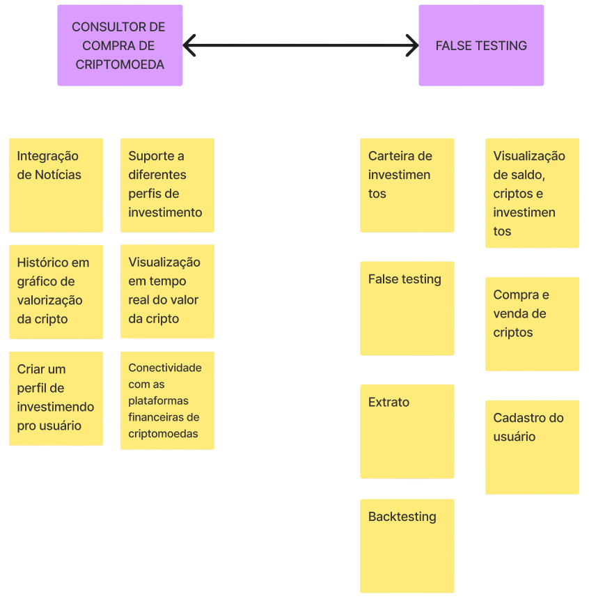
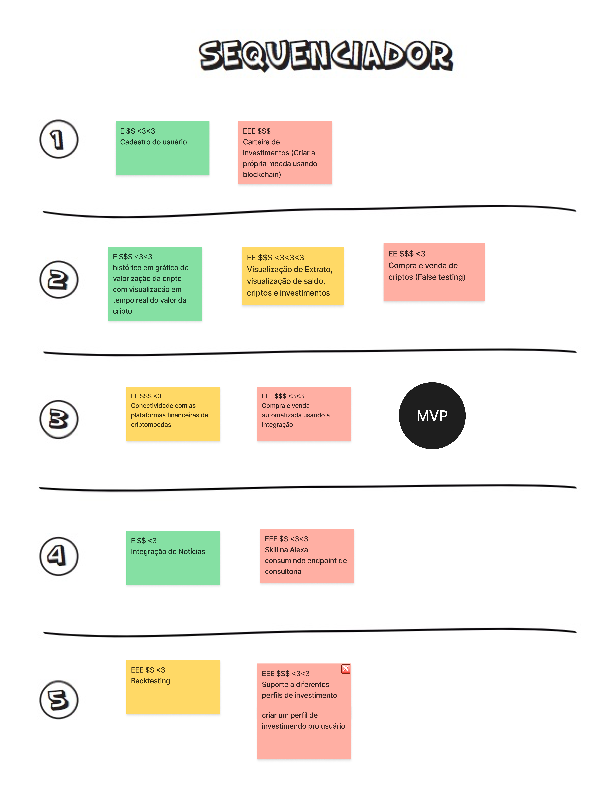
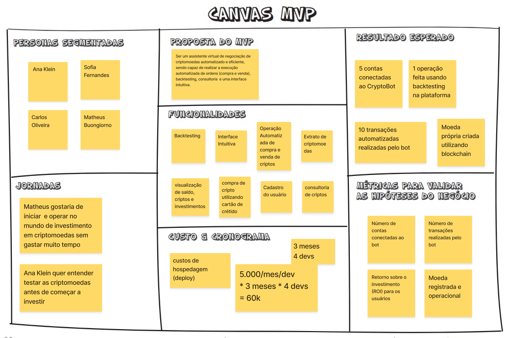

# Lean Inception

O **Lean Inception** é uma abordagem colaborativa para iniciar projetos de software de forma enxuta e eficiente. Ele combina os princípios do Lean Thinking com técnicas ágeis para ajudar equipes a definir o escopo, identificar os principais requisitos e estabelecer uma visão compartilhada do produto.

## Visão do Produto

A visão do produto no Lean Inception é uma descrição clara e concisa do que o produto deve ser e do valor que ele irá entregar aos usuários. Ela define a direção e o propósito do projeto, fornecendo uma visão compartilhada entre a equipe e os stakeholders.

A importância da visão do produto no Lean Inception está em alinhar todas as partes interessadas em relação aos objetivos e resultados esperados do projeto, servindo como um guia durante todo o desenvolvimento, garantindo que as decisões tomadas estejam alinhadas com os objetivos estratégicos do projeto.

### Texto da Visão do Produto

**Para** Investidor de Criptoativos,

**Cujo** Entendimento sobre criptomoedas é baixo,

**o** CryptoBot UnB, **é um** Bot automatizado de investimento em criptomoedas,

**que** Oferece investimento automatizando com estratégias de Spot Trading, como Buy-and-Hold aprimorado, e de Future trading. Além disso, oferece backtesting, otimização, false testing, sugestão de compras entre outras funcionalidades.

**Diferentemente da** Binance, Crypto.com, Bybit.com,

**O nosso produto** Presta uma consultoria para o usuário e oferece a nossa própria moeda para realizar operações em criptomoedas.

## Funcionalidades

As funcionalidades do projeto foram definidas de acordo com o que foi definido na visão do produto. Em roxo podem ser vistas as duas funcionalidades do projeto e em amarelo as tarefas que precisariam ser feitas para que a funcionalidade fosse implementada.

### Autorais do grupo

1. Assistente de investimento/compra de criptomoedas, indicando a mais rentável de ser comprada no momento e também capaz de criar regras de compra e venda, e
2. Criação de uma carteira de pagamento com uma criptomoeda própria (com *false testing*).

### Ideias para utilização de outro grupo

1. Chat GPT integrado no site, e
2. CRM para contatar o suporte.

## Sequenciador

No Lean Inception, a fase do sequenciador é responsável por identificar os principais requisitos do produto e definir as prioridades de desenvolvimento. Como resultado do sequenciador, temos a seguinte tabela de ondas:

## Canva MVP

O canva MVP é um documento que contém as principais informações sobre o produto, como o nome, a descrição, os principais recursos e as funcionalidades. Nesta disciplina, ele é importante porque é um documento que pode ser usado como um guia para o desenvolvimento do produto, pois contém todas as informações necessárias para que os usuários possam entender o que o produto faz e como ele pode ser usado.

## Quadro Completo

Para verificar o desenvolvimento do Lean Inception completo realizado pela equipe, basta [clicar aqui](https://www.figma.com/file/HFiJMSoTDhfuszoZskcZ4B/Template-Lean-Inception?type=whiteboard&node-id=0%3A1&t=RP4Tbr9SvZkcriQ4-1) ou acessá-lo no *widget* abaixo:

[Quadro do Lean Inception no Figma](./lean_figma.html ':include :type=iframe width=100% height=450')

# Referências
> Caroli, M. 2017. Lean Inception: Como alinhar pessoas e construir o produto certo. Acesso em 16/04/2024. Disponível em <https://caroli.org/livro/lean-inception-como-alinhar-pessoas-e-construir-o-produto-certo/>.

> Figma. 2024. Template-Lean-Inception. Acesso em 16/04/2024. Disponível em <https://www.figma.com/file/f1FSnDisSOHcemAIgX3UDM/Template-Lean-Inception?type=whiteboard&node-id=0-1&t=gZdjuEVv6UCerPXa-0>.