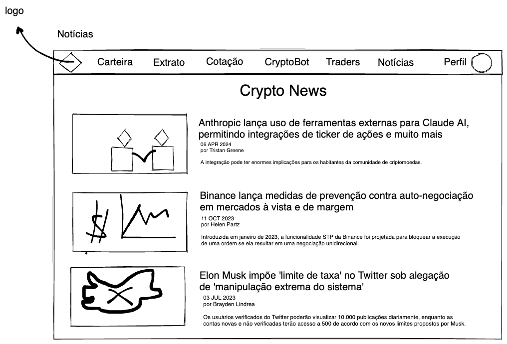

# Protótipo de Média Fidelidade

## Introdução
Um protótipo de média fidelidade é uma representação simplificada do produto, frequentemente criada para explorar ideias e testar a funcionalidade básica antes do desenvolvimento de um protótipo de alta fidelidade. Este tipo de protótipo foca em estruturar e definir os elementos mais críticos da interface do usuário (UI) e da experiência do usuário (UX), sem entrar em detalhes visuais complexos ou interações finais.

## Metodologia
Para desenvolver o protótipo de média fidelidade, a equipe utilizou a ferramenta Excalidraw, que é integrada ao Jitsi Meet, plataforma de vídeoconferências open source. Os processos incluíram a criação de wireframes detalhados que mapeiam o fluxo da interface e as funcionalidades principais. A equipe também realizou sessões de brainstorming via Jitsi Meet e revisões iterativas para assegurar que o protótipo atendesse aos objetivos iniciais.

## Protótipo de Média Fidelidade

## Referências

> Nielsen, Jakob. Wireframing & Prototyping: The Past, Present, and Future of UX Design. UX Magazine, 15 fev. 2021. Disponível em: https://uxmag.com/articles/wireframing-prototyping-the-past-present-and-future. Acesso em: 26 jan. 2024.

> UX Design Process: How to Sketch and Wireframe. Disponível em: https://www.youtube.com/watch?v=xF-c7XF7A1w. Acesso em: 26 jan. 2024.

## Histórico de versão

| Data | Versão | Modificação | Autor |
| :- | :- | :- | :- |
| 26/04/2024 | 0.1 | Criação do documento | [João Durso](https://github.com/jvsdurso) | 
| 28/04/2024 | 0.2 | Adicionando protótipo | [João Durso](https://github.com/jvsdurso) | 