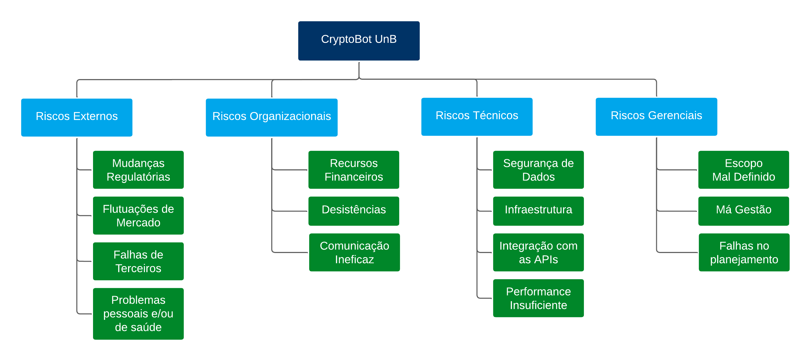

# Riscos

## Introdução
O objetivo deste documento é identificar e analisar os riscos associados ao projeto CryptoBot, visando minimizar a probabilidade de impactos negativos e maximizar as chances de sucesso do projeto. Este plano detalha as principais categorias de risco, suas possíveis consequências e as estratégias de mitigação adequadas.

## Estrutura Analítica de Riscos (EAR)
A Estrutura Analítica de Riscos organiza os riscos em uma hierarquia que inclui riscos externos, organizacionais, técnicos e de gerenciamento. Cada categoria aborda diferentes aspectos que podem afetar o projeto.

## Análise dos Riscos
Cada risco é avaliado pelo seu potencial impacto no projeto, variando de muito baixo a muito alto, onde riscos de impacto muito alto podem comprometer a viabilidade do projeto.

### Riscos Externos

| ID | Risco | Consequência  |  Contingência |  Impacto  |
|---|---|---|---|---|
| R01 | Mudanças regulatórias em criptomoedas  | Incerteza legal pode afetar as operações.  |  Monitoramento constante da legislação. |  Alto |
| R02 |  Flutuações do mercado |  Impacto nas estratégias de negociação do bot. |  Desenvolver estratégias adaptativas. | Muito Alto  |
| R03 |  Falhas de terceiros  | Interrupção do serviço e perda de dados. (ex: AWS) |  Implementar redundância e backups. |  Alto |
| R04 |  Problemas pessoais e/ou saúde  | Atraso nas entregas e sobrecarga dos membros.  |  Manter a equipe informada e reorganizar  as atividades.| Alto |

### Riscos Organizacionais

| ID | Risco | Consequência  |  Contingência |  Impacto  |
|---|---|---|---|---|
| R05 | Recursos financeiros limitados  | Pode limitar o escopo do desenvolvimento.  |  Planejamento financeiro rigoroso. |  Alto |
| R06 |  Desistência de membros |  Diminuição do volume de entregas e sobrecarga dos membros restantes.|  Manter os membros engajados. | Médio  |
| R07 |  Comunicação ineficaz | 	Atrasos e erros no desenvolvimento. |  Implementar ferramentas de comunicação eficazes. |  Médio |

### Riscos Técnicos

| ID | Risco | Consequência  |  Contingência |  Impacto  |
|---|---|---|---|---|
| R08 |  Segurança de dados |  Vazamentos podem comprometer a confiança do usuário. |  Adotar práticas de segurança robustas. | Muito Alto  |
| R09 |  Infraestrutura  |  Problemas na configuração do ambiente de desenvolvimento. (ex.: Custo) |  Procurar alternativas e seguir tutoriais. | Alto |
| R10 | Integração de APIs  | Dificuldades técnicas podem atrasar o lançamento.  |  Testes rigorosos e integração contínua. |  Médio |
| R11 |  Performance insuficiente | Pode afetar a experiência do usuário e a eficácia. |  Monitoramento e otimização contínua. |  Médio |

### Riscos Gerenciamento

| ID | Risco | Consequência  |  Contingência |  Impacto  |
|---|---|---|---|---|
| R12 |  Escopo mal definido  | 	Pode levar a mudanças de requisitos frequentes. |  Definição clara e validação constante do escopo com stakeholders. | Muito Alto |
| R13 |  Má gestão |  Retrabalho e atrasos. |  Processo de gestão de mudanças bem estruturado. | Médio  |
| R14 |  Falhas no planejamento do cronograma | Atrasos nas entregas. |  	Uso de técnicas de estimativa. |  Alto |

## Referências

> ISOTANI, Seiji. Gestão de Riscos em Projetos de Software. USP. Apresentação de Power Point. 34 slides. color. Disponível em: https://edisciplinas.usp.br/pluginfile.php/3385127/mod_resource/content/1/Aula10-GerenciaProjeto-Riscos.pdf. Acesso em: 6 mai. 2024. 

> Karolak, D. W.  Software Engineering Risk Management.  Los Alamitos, CA:  IEEE. Computer Society Press, 1996. 

## Histórico de versão

| Data | Versão | Modificação | Autor |
| :- | :- | :- | :- |
| 06/05/2024 | 0.1 | Criação do documento | [João Durso](https://github.com/jvsdurso) | 